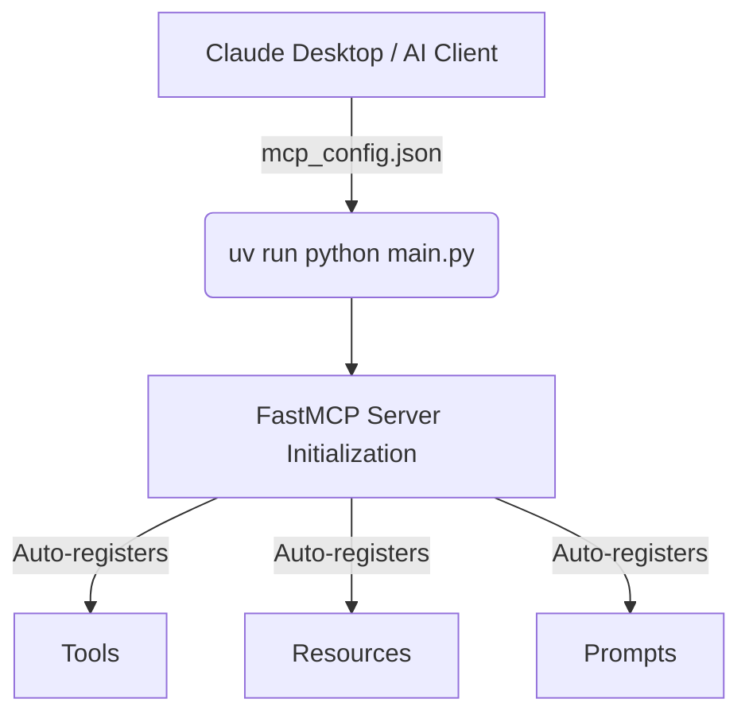
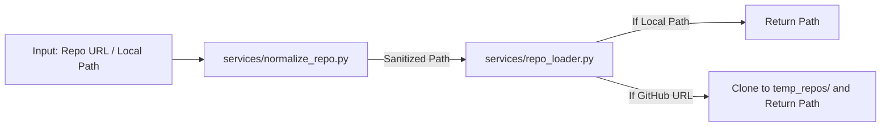
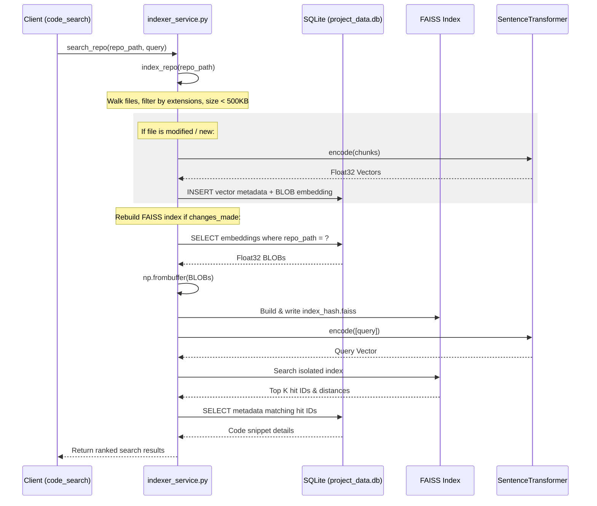
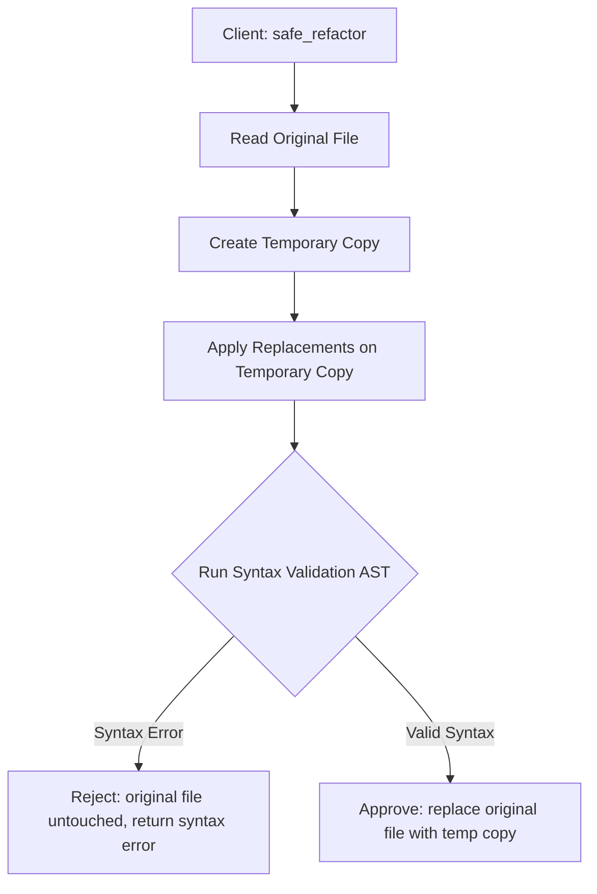

# AI Codebase MCP Server Architecture & Flow

This document details the startup process, architecture, execution pipelines, and internal workings of each tool and service in the `ai-codebase-mcp` project.

---

## 🚀 1. Server Startup and Protocol Layer

The server is built using the **Model Context Protocol (MCP)** via the `FastMCP` framework in Python. 

### Flow description:
1. The AI client (e.g. Claude Desktop) starts the server according to its configuration:
   - Command: `uv`
   - Arguments: `run python <path>\main.py`
2. `main.py` imports and instantiates `mcp = FastMCP("AI-Codebase-MCP")`.
3. `@mcp.tool()`, `@mcp.resource()`, and `@mcp.prompt()` decorators dynamically expose features to the protocol layer.
4. The server runs as a persistent JSON-RPC process over standard input/output (stdio), responding to client requests.

---

## 📂 2. Repository Loading and Normalization

Tools that analyze a repository first normalize the input path or Git URL using a two-stage pipeline:

*   **`services/normalize_repo.py`**: Standardizes slashes and sanitizes folder paths for Windows/UNIX environments.
*   **`services/repo_loader.py`**: Checks if the repository is a local directory. If it is a Git HTTP(S) URL, it checks if it has already been cloned under the `temp_repos/` folder. If not, it uses `GitPython` to clone the remote repository locally.

---

## 🔍 3. Internal Workings of Key Features

### 🧠 A. Code Search (Semantic Vector Search)
The semantic search tool provides AI-driven search capabilities by mapping text chunks to vector embeddings.

1.  **File Gathering (`services/parser_service.py`)**: Filters the workspace for code, scripts, configurations, and documentation files matching a whitelist of extensions. Files larger than **500 KB** are excluded.
2.  **Incremental Embeddings**: Chunks files line-by-line (sliding window of 20 lines). It encodes chunks using `all-MiniLM-L6-v2` via `sentence-transformers` and saves the raw float32 vector as a **BLOB** in the SQLite `vector_metadata` table.
3.  **Repository Isolation**: FAISS indices are isolated per repository path by hashing the repository path (`index_{repo_hash}.faiss`).
4.  **Instant Index Building**: To build the index, it pulls stored embedding BLOBs from SQLite and loads them directly into FAISS. **No SentenceTransformer model calls are made for unchanged files**, preventing timeouts.

### 🛡️ B. Safe Refactoring (`safe_refactor`)
Provides transaction-like code modification capabilities to prevent syntax errors from breaking codebase files.

*   **Validation Pipeline**:
    1.  Determines file type (Python, JavaScript, Java) using file extensions.
    2.  Compiles the modified file into an Abstract Syntax Tree (AST) to verify parser compatibility.
    3.  If syntax parsing fails, rejects the changes and leaves the workspace untouched.

### 📊 C. AST Querying (`ast_query` & `change_impact`)
*   **`services/ast_service.py`**: Uses custom AST syntax parsers to extract code symbols (classes, functions, interface implementations, and method signatures) from Python, Java, and JavaScript files.
*   **`change_impact`**: Traces the blast radius of unstaged or staged git changes by extracting changed lines, mapping them to AST nodes, and analyzing the project's dependency graph.

---

## 🛠️ 4. Tool Pipeline Breakdown

The following table summarizes the execution pipeline of each tool in the MCP server:

| Tool | Pipeline flow | Internal workings |
| :--- | :--- | :--- |
| `structure` | `load_repo` ➔ `get_all_files` ➔ Return paths | Lists up to 500 files matching whitelisted text/code extensions. |
| `summarize` | `load_repo` ➔ `get_all_files` ➔ LLM Prompt | Sends file structure list to Groq (Llama 3.3) to generate an architectural description. |
| `tech_stack` | `load_repo` ➔ Recursive Folder Walk ➔ Config check | Walks directories (skipping `node_modules`, `.venv`, etc.), counts file extensions, and inspects nested config files (like `package.json`). |
| `dependency_scan` | `load_repo` ➔ Parse `package.json` | Extracts dependencies and devDependencies from JavaScript/TypeScript configuration. |
| `bug_scan` | `load_repo` ➔ `get_all_files` ➔ Regex Search | Scans files for common secret patterns, credentials, or TODOs. |
| `repo_review` | `tech_stack` + `summarize` | Merges automatic stack detection with LLM analysis for a codebase review. |
| `code_search` | `load_repo` ➔ `search_repo` (FAISS) | Semantic retrieval using SentenceTransformer embeddings cached in SQLite. |
| `explain` | Code snippet ➔ LLM Prompt | Prompts Llama 3.3 to explain a code block. |
| `explain_file` | `load_repo` ➔ Read File ➔ `explain` | Opens file locally, sanitizes content, and invokes the snippet explanation pipeline. |
| `commits` | `load_repo` ➔ `GitPython` commits iteration | Reads Git commit history and formats the last 10 commits. |
| `readme` | `load_repo` ➔ `get_all_files` ➔ LLM Prompt | Prompts Llama 3.3 to write a complete markdown README for the repository. |
| `rewrite` | Code snippet + Instructions ➔ LLM | Rewrites a single code block according to instructions. |
| `cleanup_dead_code`| Code snippet ➔ LLM | Refactors code blocks to remove dead paths or unused variables. |
| `run_db_query` | Query ➔ `db_service.py` | Runs read/write SQL queries on the local SQLite DB tracking analysis history. |
| `safe_refactor` | `load_repo` ➔ Temp file modification ➔ AST check | Safely replaces line ranges, methods, or entire files. |
| `ast_query` | `load_repo` ➔ `ast_search` | Queries classes, parameters, and interface implementations via structural code parsing. |
| `change_impact` | `load_repo` ➔ `GitPython` diff ➔ AST map | Computes code changes, associates them to classes/methods, and traces downstream impacts. |
